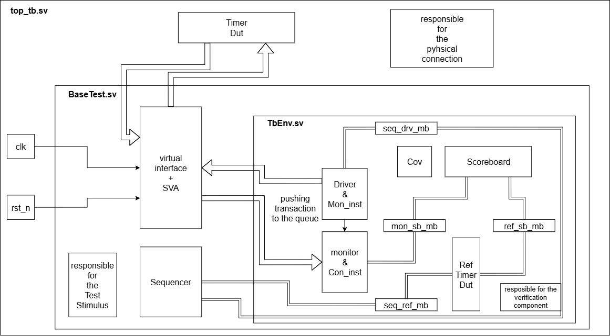

# Timer Peripheral Verification Plan
## Mid-Project Review
### Strategy, Requirements, and Execution

---

# 1. Project Overview & Scope

**DUT Summary**
* **Device:** Simple Countdown Timer Peripheral.
* **Interface:** 32-bit word-aligned slave, REQ/GNT handshake protocol.
* **Function:** Programmable countdown via `LOAD` (0x04).
* **Modes:** One-shot and Auto-reload.
* **Registers:** `CONTROL` (0x00), `LOAD` (0x04), `STATUS` (0x08).
* **Reset:** Synchronous to `clk`, active-low `reset_n`.

**Verification Objectives**
* **Functional Accuracy:** Validate countdown logic, reload behavior, and register operations.
* **Timing Correctness:** Verify bus protocol compliance (e.g., GNT latency).
* **Data Integrity:** Confirm correct R/W handling and reserved bit masking.

---

# 1.1 Scope Definitions

| **In Scope** | **Out of Scope** |
| :--- | :--- |
| **Bus Interface:** REQ/GNT protocol verification. | **Power Consumption:** Not verified. |
| **Modes:** One-shot & Auto-reload functionality. | **Misaligned Access:** Undefined behavior. |
| **Registers:** R/W behavior, W1C/RC mechanisms. | **Bus Arbitration:** Assumed single master. |
| **Corner Cases:** Load 0, Mid-count restart, Reset during op. | Other unspecified corner cases. |

---

# 2. Requirements Traceability Matrix (RTM)

| ID | Requirement | Method | Artifact |
| :--- | :--- | :--- | :--- |
| **R1** | `gnt` ≤ 3 cycles after `req`. | SVA | `ASSERT_REQ_TIMEOUT`. |
| **R2** | Read `STATUS` (0x08) clears `EXPIRED` flag. | Directed | `Test1`, `checking_status`. |
| **R3** | Write 0 to `LOAD` treated as 1. | Directed | `Load_Zero_Test`. |
| **R4** | Reset clears all registers to 0x0. | Directed | `Test3`. |
| **R5** | Auto-reload when `RELOAD_EN=1`. | Directed | `Test3`. |
| **R6** | Write `START=1` restarts active timer. | Directed | `Start_Mid_Count_Test`. |
| **R7** | Reserved bits read as 0/ignore write. | Random | `Test2`, `Random_RW_Test`. |
| **R8** | Unmapped addr: Read 0, Write ignored. | Random | `Random_RW_Test`. |

---
# TB Architecture
|  |  |
| :---: | :--- |
|  | **Dynamic Components:** • **Sequencer:** Scenarios define. • **Driver:** Drives signal through DUT using interface. • **Monitor:** Samples the output of the DUT and gather it to mailbox Transaction. • **Ref_Model:** Our func model according to the spec file. • **Scoreboard:** compare between the expected output to the actual output.  **Structure:** • **TbEnv:** Dynamic container. • **BaseTest:** Test manager. • **TB Top:** Physical connection. 
---
# 3. Verification Strategy

**Methodology**
* **Architecture:** SystemVerilog OOP Testbench.
* **Components:** Driver, Monitor, Reference Model, Scoreboard.

**Stimulus Generation**
* **Hybrid Approach:**
    * **Directed:** For specific requirements and corner cases (R2-R6).
    * **Constrained-Random:** For stress testing, address map coverage (R7, R8), and closure.

**Checking Mechanisms**
* **Scoreboard:** Compares Monitor (DUT) vs. Reference Model output.
* **SVA:** Real-time protocol assertions (e.g., `ASSERT_REQ_TIMEOUT`).

---

# 4. Functional Coverage Plan

**Coverage Goal:** 100% of defined bins and crosses.

| Coverage Point | Description | Implementation |
| :--- | :--- | :--- |
| **Operation Type** | READ vs. WRITE | `kind_cp`. |
| **Address Map** | `CONTROL`, `LOAD`, `STATUS`, Unmapped | `addr_cp`. |
| **Timer Mode** | `RELOAD_EN` (Enabled/Disabled) | `reload_en_cp` (Write only). |
| **Status Check** | `EXPIRED` Flag (Set/Clear) | `expired_cp` (Read only). |
| **Cross Coverage** | Kind $\times$ Addr, Kind $\times$ Reload | `kind_addr_cross`, `cross_kind_reload`. |

---

# 5. Test Plan Execution

| Test Name | Type | Trace | Description |
| :--- | :--- | :--- | :--- |
| **Test1** | Directed | R2 | Basic countdown (Load 7), verify Status clear. |
| **Test2** | Directed | R7 | Specific R/W access, verify masked fields. |
| **Test3** | Directed | R4, R5 | Auto-reload sequence & Reset during operation. |
| **Load_Zero** | Corner | R3 | Verify loading 0 results in 1-cycle count. |
| **Start_Mid** | Corner | R6 | Verify restart when writing START mid-count. |
| **Random_RW** | Random | R7, R8 | 50 random transactions to stress interface. |
| **Closure** | Directed | R7, R8 | Target remaining coverage holes. |

---

# 6. Closure & Metrics

**Exit Criteria**
1.  **Functional Coverage:** 100% of defined targets met.
2.  **Pass Rate:** All planned tests (Directed & Random) passing.
3.  **Assertions:** 100% of critical properties must pass.
4.  **Bug Stability:** All critical/major bugs fixed and verified.

**Verification Insight**
* **Randomization:** Essential for `Random_RW_Test` to cover address map holes and protocol stress that directed tests miss.
* **Directed Tests:** Critical for precise corner cases (e.g., Load 0) where randomization is inefficient.
* **Regression:** `test_run()` executes all tests sequentially for a repeatable baseline.